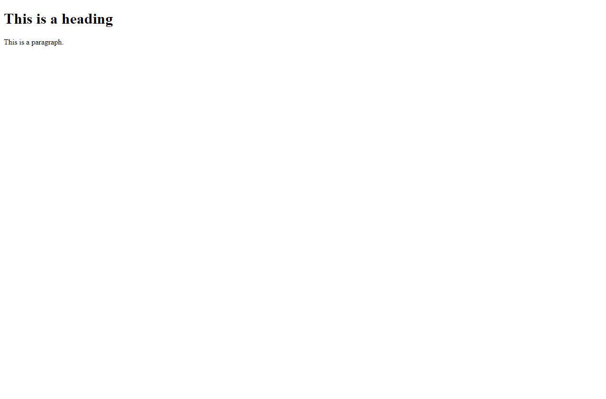

# HTML Basics 26sep23

>This project was created to study all basics statements in HTML.

This is screen it is like a view of my main HTML investigation.

## Built With

- HTML

## Live Demo

[Live Demo Link](https://livedemo.com)

## Getting Started

**This is an example of how you may give instructions on setting up your project locally.**
**Modify this file to match your project, remove sections that don't apply. For example: delete the testing section if the currect project doesn't require testing.**

To get a local copy up and running follow these simple example steps.

### Prerequisites

### Setup

### Install

### Usage

### Run tests

### Deployment

## Authors

👤 **Arístides José Molina Pérez**

- GitHub: [@aristides1000](https://github.com/aristides1000)
- Twitter: [@aristides_1000](https://twitter.com/aristides_1000)
- LinkedIn: [LinkedIn](https://www.linkedin.com/in/aristides-molina/)

👤 **Author2**

- GitHub: [@githubhandle](https://github.com/githubhandle)
- Twitter: [@twitterhandle](https://twitter.com/twitterhandle)
- LinkedIn: [LinkedIn](https://linkedin.com/linkedinhandle)

## 🤝 Contributing

Contributions, issues, and feature requests are welcome!

Feel free to check the [issues page](issues/).

## Show your support

Give a ⭐️ if you like this project!

## Acknowledgments

- Hat tip to anyone whose code was used
- Inspiration
- etc

## 📝 License

This project is [CC0 1.0 Universal](LICENSE) licensed.